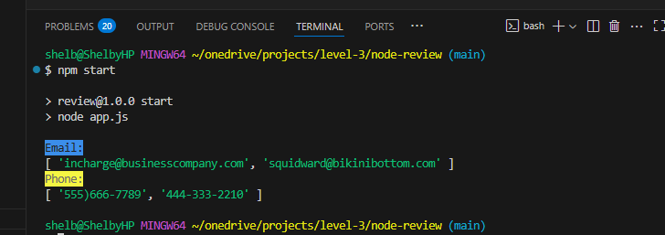

# Text Analyzer & Cleaner
An app that utilizes ES modules to analyze and clean data

## Features
- JavaScript
- Node.js
- Chalk npm
- Regex

## Function

This app takes "messy" input and extracts email and phone number information using Regex for string analysis. Chalk is used to highlight output.

## Output Example

